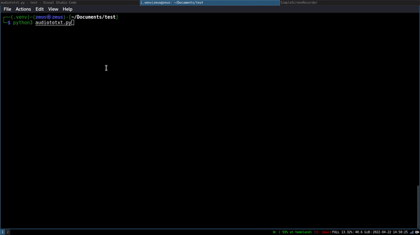

# audio-to-text-with-python

<!---These are examples. See https://shields.io for others or to customize this shield set. You might want to include dependencies, project status and license information here--->

  <!--   -->



---

## Skills
 
---

> CLI project written in [Python](https://reactjs.org/docs/getting-started.html), which transcribes an audio from mp3 format to a text file.

In this project we use the following python libs:

```
about-time==3.1.1
alive-progress==2.4.1
grapheme==0.6.0
pydub==0.25.1
SpeechRecognition==3.8.1
```
<!--
### Adjustments and improvements

The project is still in development and the next updates will focus on the following tasks:

- [ ] Task 1
- [ ] Task 2
- [ ] Task 3
- [ ] Task 4
- [ ] Task 5
-->
## 💻 Prerequisites

Before starting, make sure you've met the following requirements:
<!---These are example requirements only. Add, duplicate or remove as needed--->
* You have installed [Python](https://www.python.org) and [Docker].
* You have a `<Windows/Linux/Mac>` machine.


## 🚀 Installing

To install, follow these steps:

Linux, macOS and Windows:

```bash
git clone https://https://github.com/jmreis/audio-to-text-with-python.git
```

```bash
cd audio-to-text-with-python/
```

## ☕ Using

To use, follow these steps:

- Using virtualenv:

```bash
python3 -m venv .venv
```

```bash
source .venv/bin/activate
```

```bash
pip install -r requirements.txt
```

```bash
python <script_name>.py --<arg_name> <arg_value>
```

- Using Docker with development environment:

```bash
docker build -t <image_name> .
```

```bash
docker run <image_name> python <script_name>.py --<arg_name> <arg_value>
```

## 📫 Contributing to <project_name>
<!---If your README is long or if you have any specific process or steps you want contributors to follow, consider creating a separate CONTRIBUTING.md file--->
To contribute, follow these steps:

1. Fork this repository.
2. Create a branch: `git checkout -b <branch_name>`.
3. Make your changes and commit them: `git commit -m '<message_commit>'`
4. Push to the original branch: `git push origin <project_name> / <local>`
5. Create the pull request.

Alternatively, see the GitHub documentation at [how to create a pull request](https://help.github.com/en/github/collaborating-with-issues-and-pull-requests/creating-a-pull-request ).


[⬆ Back to top](#audio-to-text-with-python)<br>

